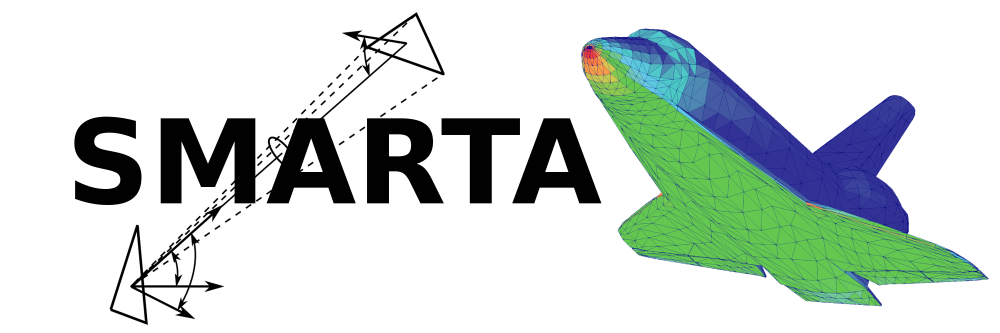

# SMARTA

*Pietro Parodi, Damien Le Quang, Federico Bariselli, Zuheyr Alsalihi, Stefano Boccelli, Thierry Magin*

SMARTA is an open-source solver for the internal or external flow of a collisionless gas that is diffusively reflected by solid surfaces.

The software was originally developed at the [von Karman Institute for Fluid Dynamics](https://www.vki.ac.be/) as a part of Pietro Parodi's M.Sc. thesis.

## Main Features
  * Accepts 3D geometries described as triangular meshes, in the \*.stl format.
  * Allows to simulate the rarefied (collisionless) flow of a gas that reflects diffusively on solid surfaces.
  * The gas can be emitted by surfaces with a streaming velocity. This means that hypersonic flows can be simulated.
  * Outlet surfaces can be porous, thus reflecting a fraction of the incoming flux.
  * The definition of the problem and its boundary conditions embraces the object-oriented philosphy.
  * NumPy's C-API links it to a module written in C that significantly speeds up the computation.
  * Most of the computation is parallelized using the Message Passing Interface (Open MPI)
  * Outputs files in the Visualization Toolkit \*.vtk format, directly readable by Paraview.
  
  Example use cases:
  
  * Gas flow in complex vacuum facilities.
  * Hypersonic rarefied flow on satellites and space debris.
  * Mixed external/internal flow concerning intakes for air-breathing electric propulsion.

## Brief Description of the Solution Method

The solution method is analogous to the radiosity method for heat radiation. Indeed it is based on recognizing the similarity in the equations that describe the heat flux in a radiation problem to the mass (particles) flux in a free molecular flow problem.

The problem can be reduced to the solution of a system of linear equations. When written in the appropriate form, the boundary conditions can be modified for a given geometry and it is possible to re-compute the solution with little additional computational cost.

The emission or scattering of molecules at surfaces by a cosine law for characterizing diffuse reflection and consequently the view-factor analogy between gas transport in the free molecular flow regime and thermal radiation has been known since the very first studies on rarefied gas flows.

With the advent of many commercial software packages for the solution of radiosity problems, it was realized that they could be used to simulate free molecular flows. These implementations however don't include the possibility of simulating an incoming gas flow with a drifting velocity component, but are restricted to a thermalized gas. This is a fundamental feature needed for the simulation of hypersonic flows, and main reason for the creation of SMARTA.

## Notes for the installation
Please follow carefully the follwing instructions for the installation.

1. First, make sure you have [Open MPI](https://www.open-mpi.org/) installed and/or the corrensponding environment module is loaded. Do this before installing the "mpi4py" module.
SMARTA has been tested with Open MPI version 1.6.6.

2. You should have Python 3 installed, including the "mpi4py", "numpy-stl" and "vtk" modules.

3. SMARTA uses NumPy's C-API extensions to speed up the calculation of mutual visibility between surfaces. It is therefore necessary to compile the extension module named rarfast.
Do this by running from the shell:

   `$ python3 setup.py build_ext --inplace`

   If it compiles without errors, the installation is complete. You can test this by entering a Python 3 interactive console and running the command

   `>>> import rarfast`

   The module should be imported without throwing errors.

You should now be able to use SMARTA.

## Notes for the execution
Make sure that Open MPI is in your $PATH. To run in parallel on [number of processors] processors use:

`$  mpiexec -np [number of processors] python3 SMARTA.py`

## Example Test Cases

In the main Python script, SMARTA.py, you will find three examples of test cases:

* A sphere placed inside a cylinder, which acts as the flow source
   
   *The result in terms of surface pressure and aerodynamic forces can be compared to the exact theory.*
   
* Clausing's cylinder for transmission probability calculation
   
   *Also in this case the result in terms of transmission probability can be compared to the exact theory of Clausing and Pond.*
   
* RAM-EP intake

   *A model of an intake for air breathing electric propulsion systems. This model was used in Parodi's M.Sc. thesis.*

The triangulated surface meshes for these test cases can be found in the GitHub repository.

To use these test cases, uncomment the respective lines in each section of the main script. You don't need to modify any other file. These examples are intuitive enough to serve as a guide in the absence of a user's manual.

## References

[1] P. Parodi, Z. Alsalihi, T. Magin; SMARTA: A code based on the view-factor method for collisionless flows. AIP Conf. Proc. 8 February 2024; 2996 (1): 060007. https://doi.org/10.1063/5.0187438 https://www.researchgate.net/publication/377982895_SMARTA_a_Code_Based_on_the_View-Factor_Method_for_Collisionless_Flows